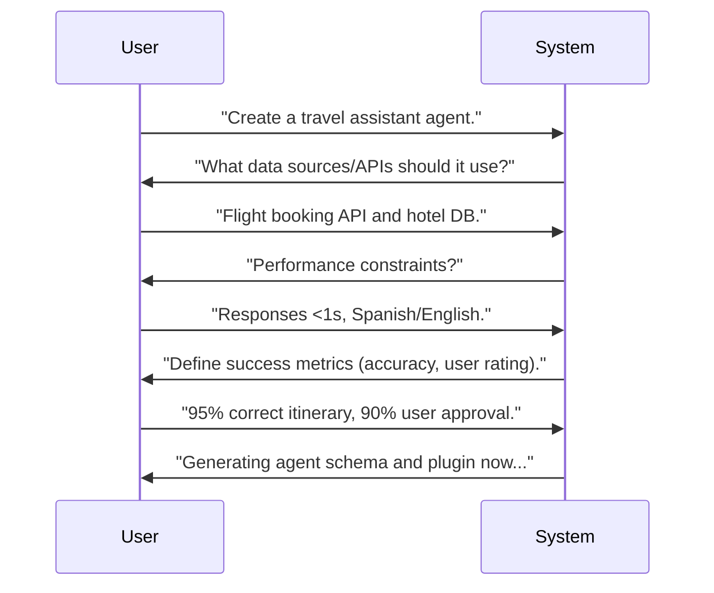

# Executive Summary  
Building customizable skills/agents that work across multiple LLM platforms is feasible by combining three things: a survey of how existing plugin/agent ecosystems define manifests, APIs, and permission models; a structured Q&A flow that elicits a user's goals, integrations, and constraints; and a single internal schema that a code-generation pipeline can translate into platform-specific artifacts. This report works through each of those pieces — a comparison of five frameworks (OpenAI's plugin/Agents SDK, Anthropic's Claude Code plugins, the open-source OpenClaw gateway, Microsoft's Agent Framework, and Google's ADK), a sample elicitation dialogue, a modular schema, generation pipelines for four target platforms, iterative-improvement mechanisms (testing, human feedback, evaluation, optional fine-tuning), a security/privacy checklist, and a staged MVP plan with timeline and risks. Tables and Mermaid diagrams illustrate the comparison, schema, and workflow.

## 1. Survey of Existing Agent/Plugin Frameworks and Standards  

**OpenAI: Custom GPT Actions, Apps (MCP), and the Agents SDK.** OpenAI's original ChatGPT Plugins format (`ai-plugin.json` manifest + OpenAPI spec) was deprecated in 2024 and is no longer a viable target. Two paths have replaced it. First, **Custom GPT Actions**: a Custom GPT is configured with an OpenAPI schema describing one or more HTTP endpoints, plus an auth block (`none`, API key, or OAuth), directly in the GPT builder UI — no separate manifest file. Second, **Apps for ChatGPT / MCP**: since late 2025, OpenAI has been moving third-party integrations toward the Model Context Protocol (MCP), where a connector exposes tools via an MCP server that ChatGPT (and other MCP-compatible clients) can call, with richer UI ("widget") support than plain Actions. Separately, for building standalone agents in code (not inside ChatGPT itself), OpenAI provides the **Agents SDK** (Python/TypeScript), which defines agents, tools, and handoffs programmatically and is the closest analogue to LangChain-style agent construction. For all three paths, OpenAI expects an HTTPS-reachable service (for Actions/MCP) or a deployable Python/TS process (for the Agents SDK), with CI/CD, monitoring, and versioned hosting as typical practice.

**Anthropic Claude Code Plugins.** Claude Code, Anthropic's agentic CLI tool, supports installable **plugins** that bundle skills, sub-agents, hooks, and MCP server configs. A plugin requires a manifest at `.claude-plugin/plugin.json` (fields like `name`, `version`, `description`, `author`) and can optionally include several sibling directories: `skills/` (Agent Skills, invoked autonomously or via `/skill-name`), `commands/` (legacy slash commands), `agents/` (specialized sub-agents), `hooks/hooks.json` (event handlers), and `.mcp.json` (external tool/MCP server definitions). A minimal manifest looks like:  
```json
{"name":"greeting-tools","version":"1.0.0","description":"Sample greeting plugin","author":{"name":"Alice"}}
```  
Each **skill** is a Markdown file at `skills/<skill-name>/SKILL.md` with YAML frontmatter (at minimum a `description` field) followed by natural-language instructions, e.g.:  
```markdown
---  
description: Greet the user with a personalized message  
---  
Greet the user named "$ARGUMENTS" warmly and ask how you can help them today.  
```  
Plugins can be developed locally with `claude --plugin-dir ./my-plugin` and distributed via a marketplace manifest (`.claude-plugin/marketplace.json`) that points to one or more plugin repos, installed in Claude Code with `/plugin install`. There is no public HTTP endpoint by default — everything runs inside the user's local CLI session, with installation scope (user/project) and marketplace trust prompts governing what gets loaded.

**OpenClaw (Self-Hosted Multi-Channel Agent Gateway).** OpenClaw is an open-source, self-hosted "Gateway" that connects an LLM-backed agent to chat surfaces (Telegram, Discord, Slack, WhatsApp, Signal, iMessage, web chat, and more) and to multiple model providers (Anthropic, OpenAI, OpenRouter, local models via vLLM, etc.). Configuration lives in a single `~/.openclaw/openclaw.json` file with top-level sections for `agents` (defaults and per-agent overrides — model routing, workspace directory, enabled tools), `models` (provider credentials and base URLs), `tools` (enabled tools and permission allowlists, e.g. restricting `shell` to specific commands), `security` (sandbox mode, network policy), and `logging`. A simplified excerpt:  
```json
{
  "agents": {
    "defaults": {
      "model": {"primary": "anthropic/claude-sonnet-4-6", "fallback": "openai/gpt-4.1"},
      "workspace": "./",
      "tools": ["file", "shell", "browser"]
    }
  },
  "models": {
    "providers": {
      "anthropic": {"apiKey": "${ANTHROPIC_API_KEY}"}
    }
  },
  "security": {"sandbox": true, "networkPolicy": "restricted"}
}
```  
Rather than a single manifest format for "plugins," OpenClaw distinguishes between **channel plugins** (connectors for chat platforms, some bundled and some external) and **agent skills**, which are loaded from per-agent or global skill directories and injected into the system prompt. Sandbox isolation (Docker or SSH-based) can be scoped per session or per agent, with fine-grained controls over filesystem access, network egress, and resource limits (memory, CPU, process counts). Because it's a self-hosted gateway rather than a hosted marketplace, trust and access control are entirely the operator's responsibility — there's no platform-level review step.

**Microsoft Agent Framework (MAF).** Microsoft’s Agent Framework, successor to Semantic Kernel and AutoGen, provides libraries in .NET and Python to build agents and orchestrate multi-agent workflows. It includes core components (session state, context providers, middleware) and supports graph-based workflows for complex routing. MAF is production-ready (v1.0 GA) for enterprise stacks (Azure Foundry, Azure OpenAI, etc.) and also supports Anthropic and Ollama providers. For example, in C# one can instantiate a foundry agent:  
```csharp
AIAgent agent = new AIProjectClient(url, credential).AsAIAgent(model:"gpt-4.1",instructions:"You are an assistant.");
Console.WriteLine(await agent.RunAsync("Hello?"));
```  
Key features include tool integration via MCP servers, graph workflows (sequential/parallel loops), and optional human-in-loop checkpoints. MAF expects developers to manage data flows: if using non-Microsoft models, builders must handle data compliance (Azure, GDPR, etc.).  

**Google Agent Development Kit (ADK).** Google’s open-source ADK (introduced 2025) is another end-to-end agent framework. It emphasizes *multi-agent by design*, rich model/tool ecosystem (Gemini, Vertex AI models, LiteLLM), and flexible orchestration. ADK provides CLI and Web-UI tooling, streaming audio/video capabilities, built-in evaluation of agent execution steps, and containerized deployment. Agents are defined in Python with schema: model choice, name, description, instructions, and tools (see sample code). For example:  
```python
from google.adk.agents import LlmAgent 
from google.adk.tools import google_Search

agent = LlmAgent(
    model="gemini-2.0-flash-exp",
    name="question_answer_agent",
    description="Agent that answers questions using search.",
    instruction="Respond to the query using Google Search.",
    tools=[google_search],
)
```  
ADK workflows support hierarchical agents and delegation, and evaluation infrastructure lets developers define tests for both final answers and intermediate steps.  

**Other Notable Frameworks:** LangChain, LlamaIndex Workflows, and CrewAI are popular libraries for building agents. LangChain is an open-source Python framework (134k stars) that abstracts model providers and composes chains/agents from modular components. It supports external orchestration tools (LangGraph for loops, LangSmith for observability). CrewAI is a standalone multi-agent framework (49k stars) with role-based agents and extensive tool connectors (web search, vector DBs, Ollama local model support). These frameworks are libraries (not platforms) but illustrate common design patterns (tool-calling agents, memory, orchestration loops).  

**Manifest and Schema Standards:** While no universal standard exists yet, common patterns emerge. OpenAI uses OpenAPI schemas (entered directly in the GPT builder for Custom GPT Actions, or wrapped in an MCP server for Apps); Claude Code uses a JSON manifest plus Markdown skills/agents and JSON hook/MCP configs; OpenClaw uses a single JSON config file (`openclaw.json`) covering agents, models, tools, and security; MAF and ADK use code-first definitions. Security models range from token-based auth (API keys/OAuth for Actions and MCP) to permission scopes (Azure policies) to operator-managed sandboxing (OpenClaw). Sandboxing varies: OpenAI Actions/MCP run as external HTTPS services; Claude Code plugins run as trusted local CLI modules with marketplace trust prompts; OpenClaw uses Docker/SSH-based sandboxes with configurable network policy; MAF/ADK rely on container isolation.

**Table 1. Platform Requirements Comparison** (manifest format, languages, deployment, auth, orchestration, trust model):

| Platform       | Manifest/Definition Format       | Languages/Runtime   | Deployment/Hosting        | Auth/Permission Model          | Orchestration & Testing                      |
|----------------|----------------------------------|---------------------|--------------------------|---------------------------------|----------------------------------------------|
| **OpenAI** | Custom GPT: OpenAPI schema entered in GPT builder (no separate manifest); Apps/MCP: MCP server definition; Agents SDK: Python/TS code | Any (web service in Python, Node, etc.) for Actions/MCP; Python/TS for Agents SDK | HTTPS server with TLS for Actions/MCP; deployable process for Agents SDK | API-key or OAuth for Actions; MCP server auth for Apps; no external auth needed for pure Agents SDK code | Tools via API calls; tests via OpenAI Evals or custom scripts; CI pipeline for endpoint/schema validation |
| **Anthropic Claude Code** | JSON `.claude-plugin/plugin.json` + `skills/`, `agents/`, `hooks/`, `.mcp.json` | Markdown for skills/agents; JSON for hooks/MCP config; CLI environment | Local CLI; no public endpoint needed | Local install/marketplace trust prompts (user/project scope); no external auth by default | Skills tested via `/skill-name` prompts in CLI; `claude --plugin-dir` for local dev; manual review before marketplace publish |
| **OpenClaw**   | Single `~/.openclaw/openclaw.json` config (agents, models, tools, security, logging) | Node.js gateway; any model provider via config | Self-hosted Gateway process (local or server) | Operator-managed: provider API keys in config/env; sandbox + network policy for tool execution | `openclaw doctor` for config validation; sandboxed tool execution (Docker/SSH); no built-in marketplace review |
| **Microsoft MAF** | Code (C#/Python classes + workflow spec) | .NET / Python       | Cloud services or on-prem (Azure or containers) | Azure AD, OAuth for integrated services | Supports .NET devtools; Azure DevOps pipelines; can integrate with LangSmith/ML evaluation |
| **Google ADK** | Code (Python agent definitions) | Python              | Containerized service; supports CLI/Web UI | OAuth / Cloud IAM; integrates with Google credentials | Built-in evaluation/test framework; supports unit tests in CLI |

*(Citations: OpenAI docs; Claude docs; OpenClaw docs; Microsoft/Google announcements.)*

## 2. Eliciting User Context and Requirements  

A crucial step is an **interactive questionnaire** to capture user intent, constraints, and data. Based on best practices (e.g. software requirements elicitation and “socratic” dialogue systems), we propose a staged Q&A flow. Below is a sample template of questions and purposes:

| Step | System Prompt                                                         | Purpose                                      |
|------|-----------------------------------------------------------------------|----------------------------------------------|
| 1    | *“What is the primary task or goal for the agent/skill?”*             | Identify core functionality (e.g. summarization, data lookup).   |
| 2    | *“Who will use this agent and in what context?”*                      | Determine user role (novice/expert) and environment (chat, CLI).   |
| 3    | *“Which data sources or APIs should it access?”*                      | Identify required integrations (databases, web APIs). |
| 4    | *“What behaviors or actions must it perform (e.g. search, calculations)?”* | Clarify enabled tools and actions.        |
| 5    | *“Are there constraints on performance, privacy, or content?”*        | Elicit latency, data privacy (PII), compliance (GDPR/HIPAA). |
| 6    | *“How will we measure success? (accuracy, latency, user satisfaction, etc.)”* | Set evaluation metrics.                 |
| 7    | *“Which LLM provider(s) or platform should it target?”*               | Platform preferences (OpenAI, Anthropic, local). |
| 8    | *“Who maintains this agent? How will updates be handled?”*             | Determine ongoing governance (owner, versioning). |

In practice, the system would iterate: ask an initial question, parse the answer, and refine follow-ups. For example, if the user mentions “internal database,” follow up with details (“What is the format/endpoint of that database?”). More advanced approaches use LLM-powered “counselor” agents that generate tailored follow-up questions. Socratic Agents’ Counselor demonstrates this: given project context, it might ask *“Given we use OAuth2 tokens, how should we handle token refresh?”* rather than a generic question. Such context-aware inquiry ensures completeness.  

**Sample Dialog:**  
```  
User: I need an agent to automate customer support queries.  
System: Which data sources (e.g. FAQs, CRM) should it have access to?  
User: Our internal FAQ database (via REST API) and a ticketing system.  
System: Are there any security requirements? (e.g. no PCI data, logging user consent)  
User: Don’t expose PII or payment info. Use OAuth2 to access APIs.  
System: What response quality metrics matter? (accuracy, clarity, speed)  
User: High accuracy (95%+ helpful answers) and responses under 2 seconds.  
```  
This iterative questioning uncovers goals, environment, integrations, constraints, and metrics. Embedding this workflow in a GUI or conversational assistant helps users specify detailed requirements, which we then formalize in a schema.

## 3. Modular Schema/Specification for Skills/Agents/Plugins  

We propose a **cross-platform metadata schema** to capture all necessary aspects of a custom skill/agent. It should encompass identification, context, code hooks, dependencies, runtime needs, prompts, and tests. Table 2 shows a sample schema of relevant fields (in YAML/JSON style):

| Field                | Type         | Description                                                  | Example                                    |
|----------------------|--------------|--------------------------------------------------------------|--------------------------------------------|
| **id**               | string       | Unique identifier or namespace (kebab-case).                 | `"inventory-agent"`                        |
| **name_for_human**   | string       | Human-readable name (can have spaces).                       | `"Inventory Manager"`                      |
| **description**      | string       | Brief description of functionality.                          | `"Assists with stock tracking."`           |
| **platforms**        | list         | Target platforms/LLMs (e.g. `openai`, `anthropic`, `llama`).  | `["openai","anthropic"]`                   |
| **version**          | string       | SemVer or timestamp (for updates).                           | `"1.0.0"`                                  |
| **author**           | object       | Author/owner info (`name`, `email`, `url`).                 | `{"name":"Alice","email":"a@x.com"}`      |
| **permissions**      | object       | Required privileges (API tokens, OAuth scopes).              | `{"apis":["https://api.crm.com"],"scopes":["read:user"]}` |
| **runtime**          | object       | Runtime requirements (language, OS, memory, GPU).           | `{"lang":"python","env":"ubuntu:22.04","cpu":"2","memory":"4G"}` |
| **dependencies**     | list         | Software libraries or system packages.                       | `["requests>=2.25","numpy"]`               |
| **entry_point**      | string       | Path or function invoked by the LLM to activate the skill.    | `"main.py:handle_request"`                 |
| **prompts**          | object       | Core prompt templates or system instructions (if any).       | `{"init_prompt":"You are an inventory assistant."}` |
| **tools**            | list         | Tool definitions (name, schema, API spec).                   | `["search_db","update_record"]`            |
| **tests**           | array of objects | Evaluation cases (input, expected output, etc.).           | `[{"input":"Check stock","expected":"..."}]` |
| **metrics**          | object       | Success metrics to track (accuracy, latency).                | `{"accuracy":0.95,"latency_ms":500}`       |

This schema merges elements from various frameworks: for example, OpenAI's Custom GPT Actions are driven by an OpenAPI document (operation IDs, paths, parameters) plus a human-readable name/description shown in the GPT builder, while *Claude Code plugins* use `skills/`, `agents/`, and `hooks/` directories under a `plugin.json` manifest. Our unified spec includes fields covering both (e.g. `name_for_human`, `description`) and adds modular fields (e.g. `entry_point`, `tools`). For each target platform, a subset of fields is used. For instance, `entry_point` might correspond to an OpenAPI operation/path for an OpenAI Action, or a Markdown skill file for Claude. The `tests` section enables automated QA (see Section 5). Having one spec allows the pipeline to output different concrete formats (OpenAPI doc + GPT config for OpenAI, `plugin.json` + `skills/` for Claude, etc.) from the same source.  

**Table 3. Sample Modular Schema (Fields and Descriptions)** – see above. (We envision representing this schema in JSON Schema or Protobuf for validation.)  

## 4. Generation Pipelines and Platform-Specific Artifacts  

To automate skill/agent creation, we define pipelines that transform the schema and Q&A results into **platform-specific artifacts**: manifests, code templates, wrappers, tests, and packaging. We illustrate this for four platforms:

- **OpenAI (Custom GPT Action or MCP App)**:  
  - **Artifacts**: `openapi.yaml` describing the tool's endpoints, backend code (e.g. Python FastAPI/Flask or Node Express) implementing those endpoints, an MCP server definition (`server.py`/`server.ts` with tool schemas) if targeting Apps/MCP, Dockerfile or hosting config, CI config.  
  - **Process**: Generate an OpenAPI spec from the schema's `tools` field, for example:
    ```yaml
    openapi: 3.0.3
    info:
      title: Inventory API
      version: 1.0.0
      description: API for warehouse data
    paths:
      /stock:
        get:
          summary: Get stock level
          parameters: 
            - name: item
              in: query
              required: true
              schema: {type: string}
          responses:
            '200':
              description: Stock level response
    ```
    For a Custom GPT, this OpenAPI document is pasted directly into the GPT builder's Actions configuration along with an auth setting (none / API key / OAuth) — there is no separate `ai-plugin.json` manifest to generate. For an MCP-based App, generate an MCP server that wraps the same backend, exposing each `tools` entry as an MCP tool with its JSON schema. Backend code (FastAPI/Flask) is generated with handlers that call the real data API. CI/CD templates (GitHub Actions) run `swagger-cli validate` on the OpenAPI doc and integration tests, e.g. `assert GET /stock?item=A returns {"item":"A","stock":100}`.

- **Anthropic Claude Code Skill/Plugin**:  
  - **Artifacts**: `.claude-plugin/plugin.json` manifest, `skills/<skill-name>/SKILL.md`, optionally `agents/`, `hooks/hooks.json`, `.mcp.json`, CI config.  
  - **Process**: From schema, create `plugin.json` with `name`, `version`, etc. For each skill in `tools`, generate `skills/<tool>/SKILL.md` with `description` frontmatter and instructions, using `$ARGUMENTS` to capture user-supplied input. For example, a "check-stock" skill:  
    ```markdown
    --- 
    description: Check inventory stock for an item  
    ---  
    Using the internal inventory database, return the current stock level for "$ARGUMENTS". Provide a concise answer.
    ```  
    Additional hook scripts go in `hooks/hooks.json`, and MCP server connections go in `.mcp.json`. Deploy for local development by running `claude --plugin-dir ./my-plugin`. Tests: use the CLI to invoke `/check-stock <item>` with sample arguments and verify the response.

- **OpenClaw Agent Skill**:  
  - **Artifacts**: a skill directory (Markdown instructions plus any helper scripts) placed under OpenClaw's skill paths, an `openclaw.json` fragment registering the skill on an agent, and tests.  
  - **Process**: From the schema's `tools` and `prompts` fields, generate a skill folder (e.g. `skills/check-stock/SKILL.md`) containing the instructions and any helper scripts the skill needs (e.g. a small Python/Node script that calls the inventory API). Generate (or merge into) an `openclaw.json` fragment that registers the skill for the target agent under `agents.list[].skills` (or `agents.defaults.skills` for all agents) and configures the relevant `tools.permissions` (e.g. an allowlist if the skill needs `shell` access). Tests can run the skill through `openclaw` in a sandboxed session and assert on the response. Package as a directory the operator copies into their OpenClaw skill path, or as a git repo they can reference directly.  

- **Microsoft Agent (MAF)**:  
  - **Artifacts**: Python/C# project files, dependency config (pip/nuget), middleware code, YAML for multi-agent scenarios, CI templates.  
  - **Process**: Use the MAF SDK to define agents/tools in code. For example, generate a Python file:  
    ```python
    from agent_framework.foundry import FoundryChatClient
    client = FoundryChatClient(project_endpoint="https://...", model="gpt-4.1")
    agent = client.as_agent(name="InventoryAgent", instructions="You assist with inventory queries.")
    agent.add_tool("check_stock", schema={"type":"function","description":"Check stock","parameters":{"item":"string"}})
    ```
    Generate tests using Microsoft’s testing tools or include as part of Azure Pipelines. Deploy on Azure or container (CA tasks), integrating with services (Key Vault for secrets).  

- **Google ADK** (optional 4th example):  
  - **Artifacts**: Python script with `LlmAgent` definitions, `tools.py` modules, `requirements.txt`, CLI config (e.g. Dockerfile for `adk run`).  
  - **Process**: Define `LlmAgent` objects from schema and instructions as shown above. Generate tool wrappers that match the schema’s `tools`. Use ADK CLI (e.g. `adk web`, `adk run`) to deploy. Tests leverage ADK’s built-in evaluation, with YAML test cases.

**Table 4. Example Generated Artifacts (OpenAI Custom GPT Action / MCP App)**:

| Artifact        | Purpose/Example                                         |
|-----------------|---------------------------------------------------------|
| `openapi.json`  | Auto-generated API schema, pasted into the GPT Action config or used to scaffold an MCP server |
| `mcp_server.py` | MCP server exposing each tool (only if targeting an MCP-based App) |
| `app.py`        | Flask/FastAPI code stub with route handlers for each tool |
| `Dockerfile`    | Container config exposing port, running app             |
| `test_plugin.py`| Unit tests invoking API endpoints and checking JSON     |
| `.github/workflows/ci.yml` | CI pipeline running lint, schema validation, tests |

*(Field names and structure based on current OpenAI Actions/MCP and Agents SDK documentation.)*  

## 5. Iterative Self-Editing and Fine-Tuning Mechanisms  

Maintaining and improving agents requires iterative loops of testing, feedback, and updates. Key mechanisms include:

- **Version Control & Testing.** Use Git (or similar) to version agent/plugin code and manifests. Include the schema and source tests in the repo. Tag releases (e.g. semantic version in manifest). Incorporate automated testing: unit tests for helper code, integration tests for entire agent flows. For OpenAI Actions/MCP servers, use OpenAI's Evals framework or third-party solutions (LangSmith) to **systematically evaluate** outputs. For example, create a test dataset of input queries with expected answers. Run CI on every commit to ensure no regressions. LangSmith's evaluation workflow suggests running offline tests and comparing experiments over versions, then also running online (production) monitors to catch drift.  

- **Human-in-the-Loop Feedback.** Deploy the agent to a limited audience and collect user feedback/ratings. Flag failures or user corrections and add them to the test suite. LangSmith supports annotation queues and integrating human evaluations. Use this feedback to refine prompts and code. For instance, if a user marks an answer as “incorrect”, log that interaction and create an eval case.

- **LLM-Based Evaluation (LLM-as-Judge).** Use an LLM to “grade” responses against criteria. For example, an LLM evaluator can check if an answer lies within required accuracy, or whether it violated content guidelines. This can automate parts of regression testing.

- **Fine-tuning and Reinforcement (RLHF).** While many agent behaviors are prompt-based, some improvements may require adjusting the underlying model. Approaches like **Self-Adapting LLMs (SEAL)** have models generating their own training data for self-improvement. In practice, we might use supervised fine-tuning (SFT) or reinforcement learning to adapt an LLM if allowed by license. For example, after collecting correct Q&A pairs, one could fine-tune a local Llama or GPT model to better handle inventory queries. During CI, if an eval fails, one could automatically generate fine-tuning examples. However, note many models (GPT-4.5, Claude, etc.) currently restrict user fine-tuning. 

- **Automated Self-Editing.** Research on self-improving agents (sometimes discussed under names like "Gödel Agent") and orchestration frameworks like LangGraph point toward including a self-review step in the pipeline: an LLM agent proposes changes to prompts or code and simulates test results (a critique-and-revise loop), with suggestions flagged for human review before merging. Multi-agent frameworks such as CrewAI similarly support rollback if a self-modification fails tests. Fully autonomous self-editing remains experimental, but structured workflows (LangGraph or explicit state machines) can orchestrate these loops safely.

By combining **continuous integration** (automated tests on code), **continuous evaluation** (LangSmith/online eval), and optional **fine-tuning loops**, the agent can gradually improve. The “model optimization” loop from OpenAI (“write evals, prompt, fine-tune, re-evaluate”) applies here: treat the agent’s code+prompts as the “model” to be optimized via iterative testing and adjustments.  

## 6. Security, Privacy, and Compliance  

Building agents/plugins poses security and privacy risks. Key considerations and mitigations include:

- **Least Privilege and Auth.** Only grant the agent the minimum API access needed. For OpenAI Custom GPT Actions or MCP Apps, use OAuth scopes or API-key authentication as defined in the OpenAPI/MCP config. Never embed secret keys in public manifests, OpenAPI specs, or code; use secure vaults or environment variables (AWS Secrets Manager, Azure Key Vault) for secrets. Similarly, Claude Code plugins can use `.env` files and Claude Code's settings for credentials, and OpenClaw reads provider keys from `openclaw.json` (typically via `${ENV_VAR}` substitution rather than literal values).

- **Data Handling and Privacy.** Ensure sensitive data (PII, health/finance info) is not sent to third-party LLMs. If necessary, anonymize or encrypt data. Follow data-residency rules (e.g. GDPR requires data localization for EU users). Microsoft explicitly warns that using third-party LLM endpoints requires you to manage data flows to comply with your organization’s policies. Agents that process user data should implement consent and the ability to audit or delete data.

- **Sandboxing and Code Safety.** Plugins that execute code or shell commands must run in isolated environments. Claude Code, for example, runs shell hooks at user privilege; ensure these scripts are audited. OpenClaw and ADK operate in container sandboxes or enforced environments. Always validate external tool outputs before feeding back to the LLM to avoid adversarial “poisoning.”

- **Content Filters and Guardrails.** Include content filters for disallowed outputs. Many platforms (Anthropic, Microsoft, Google) provide safety APIs or detection models to pre-screen answers. Design the agent’s prompts and logic to reject or escalate queries outside the defined domain.

- **Auditing and Logging.** Maintain logs of agent actions and data accesses. Implement logging (as in LangSmith or custom) for each request/response. This supports auditing and debugging, and is often a compliance requirement.

- **Dependency Security.** Vet third-party libraries (using tools like Snyk or GitHub Dependabot). Define dependencies versions strictly in manifests (e.g. Claude `plugin.json` can pin versions). 

By following these mitigations (principle of least privilege, secure deployment, logging, vetting) and leveraging platform security features (OAuth flows, encryption, network policies), risks can be managed in line with corporate and regulatory standards.  

## 7. Recommended Tooling, Libraries, and Deployment Patterns  

- **Developer Tools & Frameworks:** Use established SDKs and libraries. For OpenAI, the *openai* Python package and *FastAPI*/Flask are common. For Anthropic, use the *claude* SDK and Node/CLI as documented. For Orchestration frameworks, LangChain (Python), CrewAI (Python), or MAF (Python/.NET) help structure logic. LangSmith (LangChain) or OpenAI Evals can be used for testing and metrics. Use *Docker* to containerize services, with *Docker Compose* or *Kubernetes* for orchestration. 

- **Version Control & CI/CD:** Host code/repos on GitHub/GitLab. Set up CI pipelines to run manifest/schema linters (e.g. Swagger Editor for OpenAPI), unit tests, and integration tests. Continuous deployment can push to cloud services: e.g. use AWS Lambda/API Gateway for stateless plugins, or Azure Web Apps/Azure Functions, or Google Cloud Run for ADK. GitHub Packages or npm registry for plugin distribution.

- **Authentication Libraries:** Leverage OAuth libraries (e.g. Authlib, MSAL, Google Auth) to handle user tokens. For serverless plugins, use platform-provided secrets managers (AWS Secrets Manager, GCP Secret Manager, Azure Key Vault) rather than hardcoding credentials.

- **Logging/Monitoring:** Integrate with ELK stack or cloud logging (CloudWatch, Azure Monitor) for logs. Use observability platforms (LangSmith) for end-to-end traceability. Include metrics (Prometheus, or custom) for usage and error tracking.

- **Sandboxing:** For any code execution, use container isolation or sandbox services (e.g. AWS CodeBuild, GitHub Codespaces, or the Claude CLI sandbox mode) to restrict system access.

- **Distribution:** Claude Code plugins are distributed as git repos referenced from a `.claude-plugin/marketplace.json` (installed via `/plugin install`), not as PyPI packages. OpenClaw skills/plugins are similarly distributed as directories or git repos the operator points OpenClaw at. If a skill needs helper code with its own dependencies, package that code conventionally (PyPI for Python helpers, npm for Node helpers) and reference it from the skill, using semantic versioning for the skill/plugin itself.

- **Workflow Orchestration:** For complex multi-agent flows, use directed graph libraries: LangGraph or MAF’s workflow API. Document architecture with diagrams (Mermaid or UML) and keep YAML/JSON configs in version control.  

## 8. Prototype Design, Plan, and Risks  

We propose an **MVP prototype** that implements the end-to-end pipeline for one platform (e.g. an OpenAI Custom GPT Action).  

**Milestones:**  
1. **Requirement Gathering Module (2–3 weeks).** Build the interactive questionnaire (CLI or simple web form) using the Q&A template above. Validate it collects the necessary fields into an internal schema.  
2. **Schema & Code Generator (4–6 weeks).** Implement the modular schema data model. Write code that fills this schema and emits platform-specific outputs. E.g. produce an OpenAPI spec, GPT Action config, and skeleton backend code from the schema. Ensure it can also import answers from the questionnaire.  
3. **Platform-specific Pipeline (4–6 weeks).** For the chosen platform (e.g. an OpenAI Custom GPT Action), flesh out the generation: scaffold a web server, Dockerfile, CI config, and sample test. Repeat for a second platform (e.g. Claude Code) as proof of generality.  
4. **Testing & Iteration (4 weeks).** Develop evals for the generated agent (using sample queries). Iterate on prompts and code based on feedback. Implement one cycle of fix and re-generate.  
5. **Security/Compliance Review (2 weeks).** Conduct threat modeling and data flow analysis. Ensure all secrets are managed and add necessary safeguards (e.g. input validation).  

**Deliverables:** project documentation, the interactive spec tool, generated plugin examples (with source), test suite, CI pipelines.  

**Estimated Effort:** A small team (2–3 engineers) over ~4–6 months for a robust MVP across *two* platforms, plus documentation. Additional time would be needed for more platforms and complex features (RLHF loops, UI polish).  

**Risks and Mitigations:**  
- **Evolving Standards:** LLM platforms may update plugin specifications (as happened with OpenAI v1 manifest). *Mitigation:* design schema to be extensible and monitor official docs for changes.  
- **Model Limitations:** Not all desired behavior can be achieved by prompting alone. Some tasks may need proprietary models or fine-tuning (which may be unavailable). *Mitigation:* flag such requirements during elicitation and fallback to rule-based if needed.  
- **Security Breaches:** Mishandled secrets or API keys could leak. *Mitigation:* Strict code reviews, automated secret scans, use of managed identity services.  
- **Complexity Overhead:** The abstraction layers (LangChain, MAF) may add complexity. *Mitigation:* Emphasize minimal setups for MVP; only adopt heavier frameworks once core flows are proven.  

**Mermaid Diagrams:** Figure 1 shows the system architecture (modules and feedback loops). Figure 2 illustrates the interactive Q&A workflow.

```mermaid
flowchart TB
  subgraph User
    User[User]
  end
  subgraph AgentBuilderSystem
    QNA[Questionnaire Module]
    Schema[Schema/Spec Generator]
    Pipeline[Code Generation Pipeline]
    Testing[Automated Testing & Evaluation]
    Storage[Versioned Repo]
    Deployment[Packaging & Deployment]
  end
  User --> QNA --> Schema --> Pipeline --> Testing --> Deployment
  Testing -- "feedback/metrics" --> Schema
  Testing -- "failure reports" --> Pipeline
  Deployment --> Storage
  Storage -- "version control" --> Schema
```



By following this analytical design – surveying existing standards, employing structured Q&A elicitation, modular schema design, and automated generation with iterative QA loops – we can build a flexible system that produces tailored skills/agents for any LLM platform. The provided tables and examples illustrate the approach concretely for multiple environments. 

**Sources:**
- OpenAI Custom GPT Actions, Apps/MCP, and Agents SDK — platform.openai.com, developers.openai.com (developer docs)
- Anthropic Claude Code plugins, skills, and marketplace structure — docs.claude.com/en/docs/claude-code/plugins, code.claude.com/docs/en/plugins
- OpenClaw documentation (Gateway, agents, config reference, sandboxing) — docs.openclaw.ai
- Microsoft Agent Framework documentation — learn.microsoft.com/agent-framework
- Google Agent Development Kit documentation — google.github.io/adk-docs
- LangChain / LangGraph / LangSmith documentation — docs.langchain.com, docs.smith.langchain.com
- CrewAI documentation — docs.crewai.com
- "Self-Adapting Language Models" (SEAL) — arXiv

This list reflects the primary sources consulted; specific page paths may move as vendors restructure docs, so verify against current documentation before relying on exact field names or CLI commands.